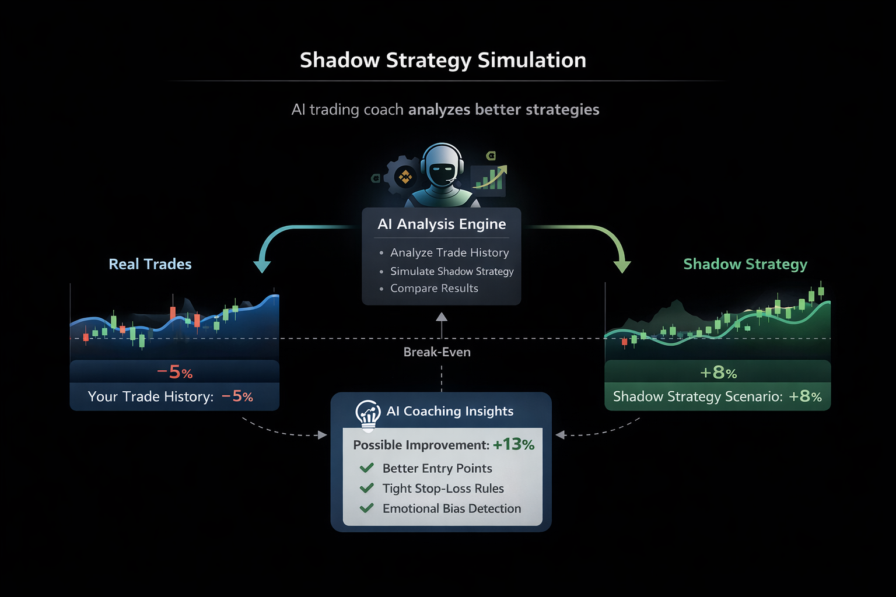
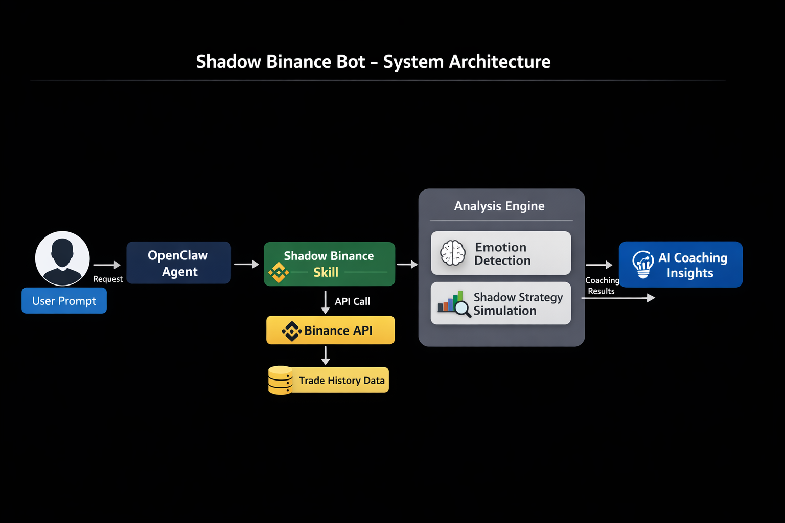

# Shadow Binance Bot

   

AI-powered trading coach that analyzes your Binance trades and shows how alternative strategies could have improved your results.

Instead of guessing what went wrong, traders can see a simulated "shadow strategy" running alongside their real trades.

This transforms trading mistakes into structured learning.

---

## Problem

Most crypto traders lose money not because of lack of information, but because of:

- FOMO entries
- Panic selling
- Over-leveraging
- Poor risk management
- Emotional trading decisions

Even experienced traders struggle to objectively analyze their past trades.

---

## Solution

Shadow Mode Trading Trainer analyzes a trader’s Binance history and runs parallel strategy simulations.

It compares:

**Real Trades**  
vs  
**Shadow Strategy Performance**

This allows traders to learn:

- how different entries would change results
- how position sizing affects risk
- how emotional trading impacts performance

The system acts as a **trading coach instead of a signal generator**.

---

## Shadow Strategy Simulation



This system analyzes a trader's real trade history and simulates alternative strategies in a "shadow mode".

By comparing real trades with AI-simulated strategies, the system can identify:

- missed opportunities
- emotional trading patterns
- better entry and exit strategies
- potential performance improvements

---

## Key Features

### Portfolio Analysis

Analyze Binance Spot and Futures positions including:

- entry timing
- position size
- profit and loss
- leverage usage

### Shadow Strategy Simulation

Run alternative strategies on historical trades:

- Dollar Cost Averaging (DCA)
- support level entries
- reduced leverage
- improved stop-loss placement

### Emotional Trading Detection

Detect patterns such as:

- FOMO entries
- panic selling
- revenge trading
- over-leveraging

### AI Coaching Feedback

Provide constructive insights including:

- behavioral patterns
- strategy improvement suggestions
- risk management advice

---

## Use Cases

Shadow Binance Bot can help traders:

- understand why certain trades failed
- simulate alternative strategies
- detect emotional trading behavior
- improve long-term trading discipline

---

## How It Works

1. Connect Binance account (read-only API)
2. Retrieve trading history
3. Analyze real trading behavior
4. Detect emotional trading patterns
5. Run simulated alternative strategies
6. Compare results and generate coaching insights

---

## System Architecture



---

## Tech Stack

- OpenClaw AI Agent Framework
- Binance API
- Large Language Models
- Trading Strategy Simulation

---

## Example Output

**Portfolio Summary**

BTCUSDT position: +4.2%  
ETHUSDT position: -2.1%

**Shadow Simulation**

BTCUSDT alternative strategy: +6.8%  
ETHUSDT alternative strategy: +3.5%

**Key Observations**

- FOMO entry detected on BTCUSDT  
- Panic exit detected on ETHUSDT

**Coaching Insight**

Your entries often occur after strong price momentum.

**Suggested Improvements**

- wait for pullbacks before entering  
- reduce leverage  
- define stop-loss levels before opening trades

---

## Demo Mode

If Binance API keys are not configured, the system runs in **Demo Mode**.

Demo Mode simulates example portfolios to demonstrate how the shadow strategy engine works.

This allows users to understand the concept without connecting real accounts.

---

## Safety and Risk Awareness

This project promotes responsible trading practices.

The system encourages:

- controlled risk per trade
- disciplined entries
- avoidance of emotional trading
- long-term strategy improvement

This project **does not provide financial advice or trading signals**.

---

## Project Structure

```
Shadow-Binance-Bot/
  README.md
  LICENSE
  package.json
  SKILL.md
  CONTRIBUTING.md
  CHANGELOG.md
  .gitignore
  .editorconfig
  config.env.example
  src/
    index.cjs         # Main entry point
    binance.cjs       # Binance API connection
    analyzer.cjs      # Trade analysis engine
    shadowSim.cjs     # Shadow strategy simulation
    coach.cjs         # AI coaching feedback
  tests/
    analyzer.test.cjs
    shadowSim.test.cjs
  assets/
    architecture.png
    shadow-simulation.png
```

---

## How to Run

### Quick Start

This bot supports two credential methods. **Use env vars (Method 1) if your platform supports it.**

#### Method 1 — Environment variables (recommended)

```bash
export BINANCE_API_KEY=your_api_key
export BINANCE_API_SECRET=your_api_secret
node src/index.cjs
```

#### Method 2 — Local config file (for local development)

```bash
git clone https://github.com/acevod/Shadow-Binance-Bot.git
cd Shadow-Binance-Bot
cp config.env.example config.env
nano config.env  # fill in your keys
node src/index.cjs
```

**Note:** If `BINANCE_API_KEY` and `BINANCE_API_SECRET` are set as environment variables, `config.env` is not required.

### Get Your Binance API Key

1. Log in to Binance
2. Go to Account -> API Management
3. Create your API Key and Secret Key
4. Set Read-Only permissions
5. Copy your API Key and Secret Key
6. **Restrict the key to your IP address** (required for platform deployments)

Never share your Secret Key! Restrict the key to your IP address in Binance API Settings.

---

## Why This Matters

Crypto trading platforms provide powerful tools for execution.

But traders rarely receive feedback on **how their decisions affect outcomes**.

Shadow Mode Trading Trainer bridges that gap by turning historical trading data into a learning system.

The goal is to help traders evolve from reactive decision-making to disciplined strategy development.

---

## Future Improvements

- advanced AI trade pattern recognition
- portfolio risk scoring
- strategy backtesting engine
- trading psychology analysis
- visual performance dashboards

---

## License

MIT License
