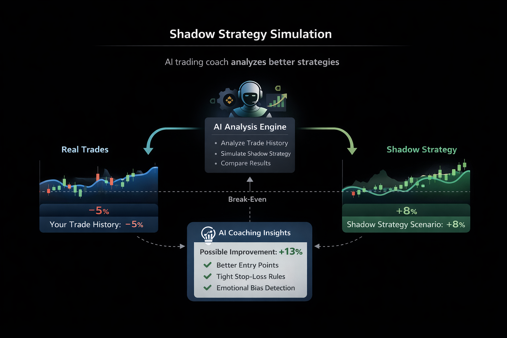
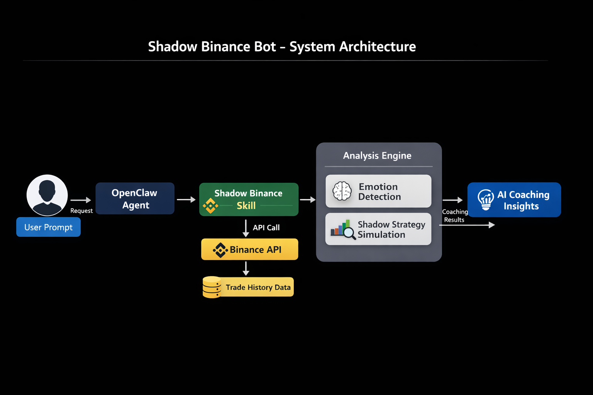

# Shadow Binance Bot

[](LICENSE) [](https://openclaw.ai) [](https://binance.com) [](https://github.com/acevod/Shadow-Binance-Bot) [](https://x.com/binance/status/2041259653305114833)

AI-powered trading coach that analyzes your Binance trades and shows how alternative strategies could have improved your results.

Instead of guessing what went wrong, traders can see a simulated "shadow strategy" running alongside their real trades.

This transforms trading mistakes into structured learning.

---

## 🏆 Recognition

Nominated in the **Binance OpenClaw AI Builder Contest** (March 2026) — selected among the top community submissions out of a 48.6 BNB prize pool, recognized in [Binance's official winners & nominees announcement](https://x.com/binance/status/2041259653305114833).

---

## Problem

Most crypto traders lose money not because of lack of information, but because of:

- FOMO entries
- Panic selling
- Over-leveraging
- Poor risk management
- Emotional trading decisions

Even experienced traders struggle to objectively analyze their past trades.

---

## Solution

Shadow Mode Trading Trainer analyzes a trader’s Binance history and runs parallel strategy simulations.

It compares:

**Real Trades**  
vs  
**Shadow Strategy Performance**

This allows traders to learn:

- how different entries would change results
- how position sizing affects risk
- how emotional trading impacts performance

The system acts as a **trading coach instead of a signal generator**.

---

## Shadow Strategy Simulation



This system analyzes a trader's real trade history and simulates alternative strategies in a "shadow mode".

By comparing real trades with AI-simulated strategies, the system can identify:

- missed opportunities
- emotional trading patterns
- better entry and exit strategies
- potential performance improvements

---

## Key Features

### Portfolio Analysis

Analyze Binance Spot and Futures trading history including:

- win rate, risk:reward, and PnL by period
- best/worst trading hours (UTC)
- fee and funding cost breakdown
- Futures account balance (wallet, unrealized PnL, margin balance) and non-zero Spot balances, when the API key has read access

### Shadow Strategy Simulation

Run alternative strategies on historical trades:

- Dollar Cost Averaging (DCA)
- support level entries
- reduced leverage
- improved stop-loss placement

### Trading Pattern Detection

Flag statistical patterns in your trading history:

- low win rate or poor risk:reward ratio
- consecutive loss streaks (possible tilt/revenge trading)
- overtrading (too many trades per day)
- hours of the day with a notably low or high historical win rate

These are heuristic signals based on your trade data, not a claim about your emotional state at the time.

### AI Coaching Feedback

Provide constructive insights including:

- behavioral patterns
- strategy improvement suggestions
- risk management advice

---

## Use Cases

Shadow Binance Bot can help traders:

- understand why certain trades failed
- simulate alternative strategies
- detect emotional trading behavior
- improve long-term trading discipline

---

## How It Works

1. Connect Binance account (read-only API)
2. Retrieve trading history
3. Analyze real trading behavior
4. Detect emotional trading patterns
5. Run simulated alternative strategies
6. Compare results and generate coaching insights

---

## System Architecture



---

## Tech Stack

- OpenClaw AI Agent Framework
- Binance API
- Large Language Models
- Trading Strategy Simulation

---

## Example Output

A real sample from a single run (demo mode, values vary by account/run since demo data is randomly generated):

```
SUMMARY
--------------------------------------------
Period: 2026-08-19 to 2026-09-18 (30 days)
Trades: 60
Win Rate: 50%
Net PnL: 808.2491 USDT
Verdict: POSITIVE NET PnL

PROBLEMS IDENTIFIED
--------------------------------------------
1. Poor Risk:Reward
   You're using 1:2.39 risk:reward. You need at least 1:3 to cover your losses.

RECOMMENDATIONS
--------------------------------------------
1. [Priority 1] Scenario: Improved Risk:Reward (1:4)
   [Illustrative] Holding the same win rate but targeting 1:4 R:R (instead of 1:2.39)...
   Potential: 935.8059 USDT (illustrative; not a forecast)
```

Run `node src/index.cjs` with no API keys set to see the full report on generated demo data.

---

## Demo Mode

If Binance API keys are not configured, the system runs in **Demo Mode**.

Demo Mode simulates example portfolios to demonstrate how the shadow strategy engine works.

This allows users to understand the concept without connecting real accounts.

---

## Safety and Risk Awareness

This project promotes responsible trading practices.

The system encourages:

- controlled risk per trade
- disciplined entries
- avoidance of emotional trading
- long-term strategy improvement

This project **does not provide financial advice or trading signals**.

---

## Project Structure

```
Shadow-Binance-Bot/
  README.md
  LICENSE
  package.json
  SKILL.md
  CONTRIBUTING.md
  CHANGELOG.md
  .gitignore
  .editorconfig
  config.env.example
  src/
    index.cjs         # Main entry point
    binance.cjs       # Binance API connection
    analyzer.cjs      # Trade analysis engine
    shadowSim.cjs     # Shadow strategy simulation
    coach.cjs         # AI coaching feedback
  tests/
    analyzer.test.cjs
    shadowSim.test.cjs
    binance.test.cjs
    coach.test.cjs
  assets/
    architecture.png
    shadow-simulation.png
```

---

## How to Run

### Quick Start

This bot supports two credential methods. **Use env vars (Method 1) if your platform supports it.**

#### Method 1 — Environment variables (recommended)

```bash
export BINANCE_API_KEY=your_api_key
export BINANCE_API_SECRET=your_api_secret
node src/index.cjs
```

#### Method 2 — Local config file (for local development)

```bash
git clone https://github.com/acevod/Shadow-Binance-Bot.git
cd Shadow-Binance-Bot
cp config.env.example config.env
nano config.env  # fill in your keys
node src/index.cjs
```

**Note:** If `BINANCE_API_KEY` and `BINANCE_API_SECRET` are set as environment variables, `config.env` is not required.

### Get Your Binance API Key

1. Log in to Binance
2. Go to Account -> API Management
3. Create your API Key and Secret Key
4. Set Read-Only permissions
5. Copy your API Key and Secret Key
6. **Restrict the key to your IP address** (required for platform deployments)

**For full coverage, enable "Read Info" for both Spot & Futures.** A key scoped to only one product still works — the tool will connect and report on whichever product it can access, and note what it couldn't.

Never share your Secret Key! Restrict the key to your IP address in Binance API Settings.

### Data Coverage

- Futures income history is fetched in 7-day windows going back up to **90 days** (Binance's own retention window for this endpoint) — older activity isn't available through this API and won't appear in the report.
- Spot trade history is paginated per symbol, up to 5,000 trades per symbol by default.
- If a Spot symbol fails to fetch or the fetch is incomplete, the report says so explicitly rather than presenting partial data as complete.

---

## Running Tests

```bash
npm test
```

Runs the full test suite (`tests/analyzer.test.cjs`, `tests/shadowSim.test.cjs`, `tests/binance.test.cjs`, `tests/coach.test.cjs`) — pure unit tests plus mocked-network regression tests for pagination and rate-limit backoff. No real Binance API calls or credentials are needed to run the tests.

---

## Why This Matters

Crypto trading platforms provide powerful tools for execution.

But traders rarely receive feedback on **how their decisions affect outcomes**.

Shadow Mode Trading Trainer bridges that gap by turning historical trading data into a learning system.

The goal is to help traders evolve from reactive decision-making to disciplined strategy development.

---

## License

MIT License
